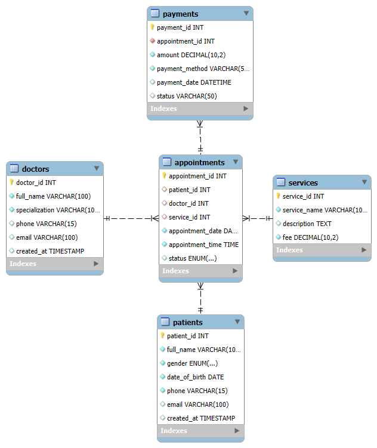

# 🏥 Clinic Booking System

## 📋 Project Description

This project implements a **Clinic Booking System** using:
- **MySQL** for database design and management
- **FastAPI** (Python) for building a RESTful CRUD API

The system enables the creation, retrieval, updating, and deletion of patient records through a simple and intuitive API.

---

## ✅ Features

- Well-structured **relational database schema**
- CRUD operations for **Patient** entity:
  - Create patient
  - View all patients
  - Update patient info
  - Delete patient
- API documented and testable via Swagger UI

---

## 🧠 Question 1: MySQL Database

The file clinic_boking_db.sql includes:
 - CREATE TABLE statements for all entities
 - Proper use of constraints:
   - Primary Keys (PK)
   - Foreign Keys (FK)
   - NOT NULL
   - UNIQUE
 - Sample INSERT INTO data for testing
 - Inline SQL comments for clarity
---

## 💻 Question 2: FastAPI CRUD API

### 🗂 Project Structure

clinic_booking_project/
├── README.md
├── question1_clinic_schema.sql
├── ERD.png
├── clinic_api.txt
└── app/
    ├── main.py
    ├── models.py
    ├── schemas.py
    ├── crud.py
    ├── database.py
    └── __init__.py

**## 📊 ERD (Entity Relationship Diagram)**

**## 🧩 Technologies Used**
MySQL
FastAPI
SQLAlchemy
Pydantic
Uvicorn
Python 3.11+

***## 📌 Author***
Developed by Sophia Nakhanu
Course: Web Development + Database Systems